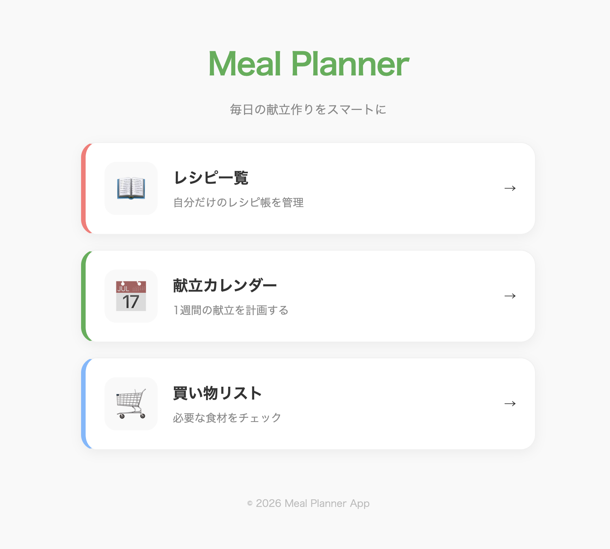
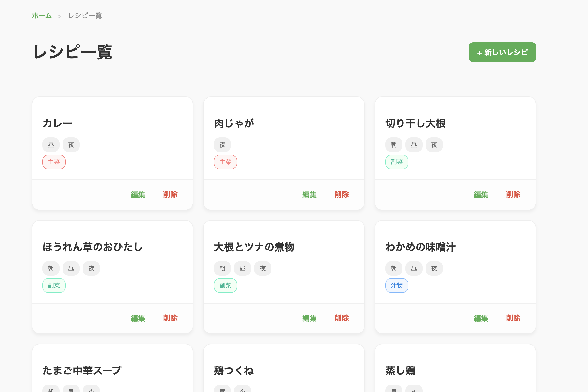
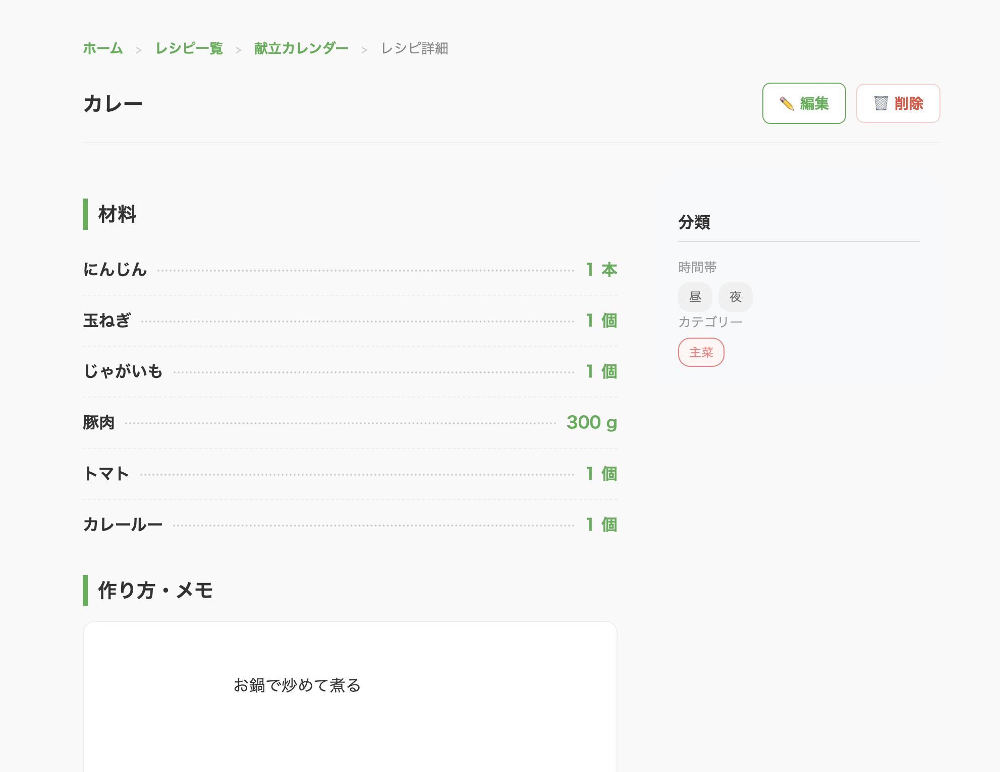
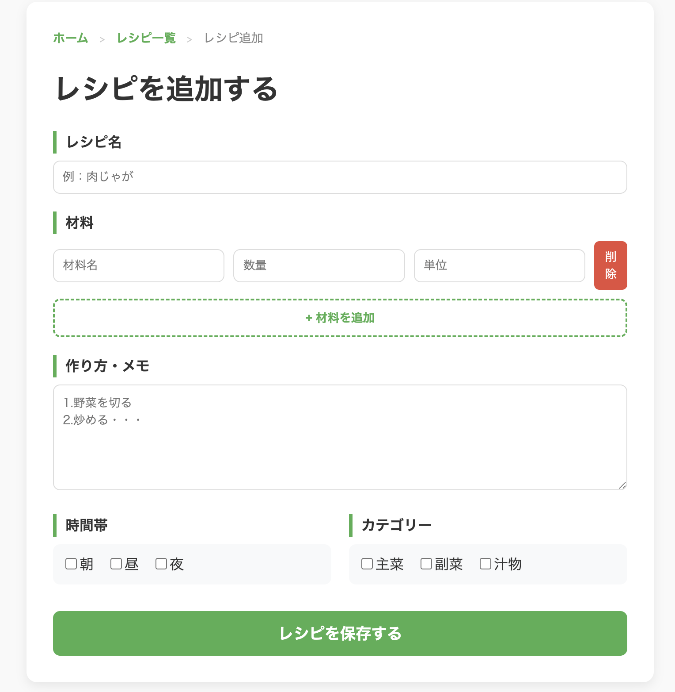
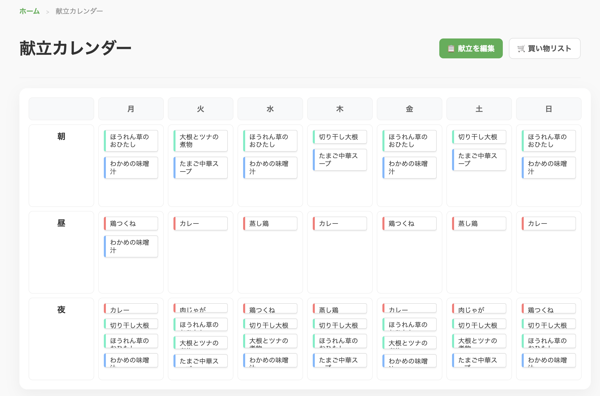
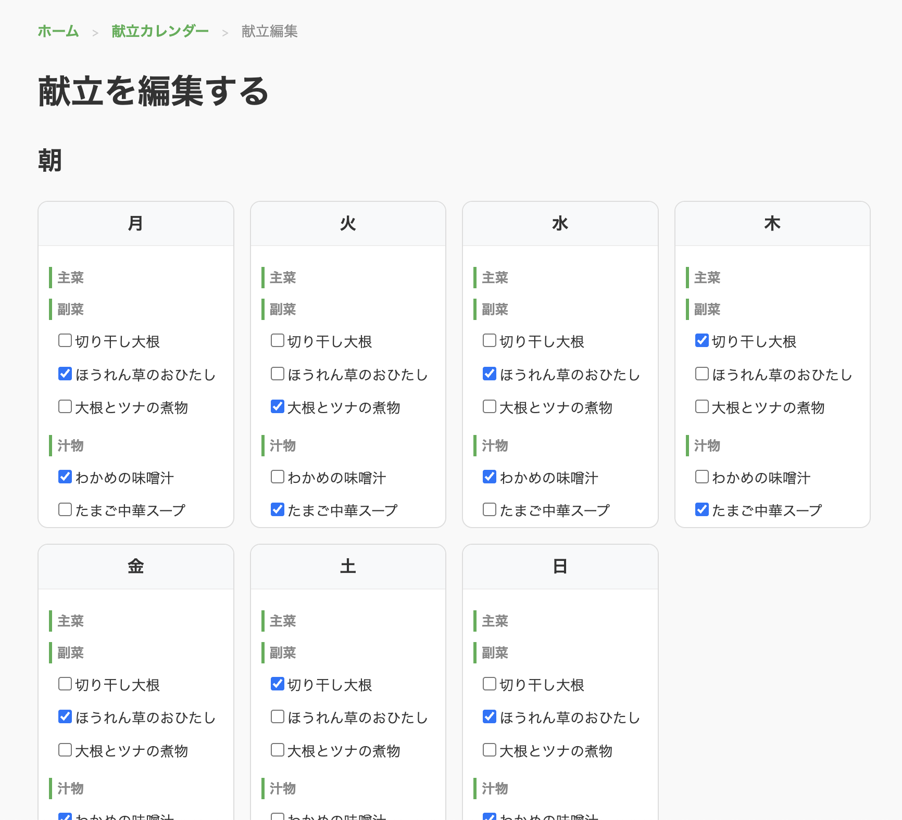
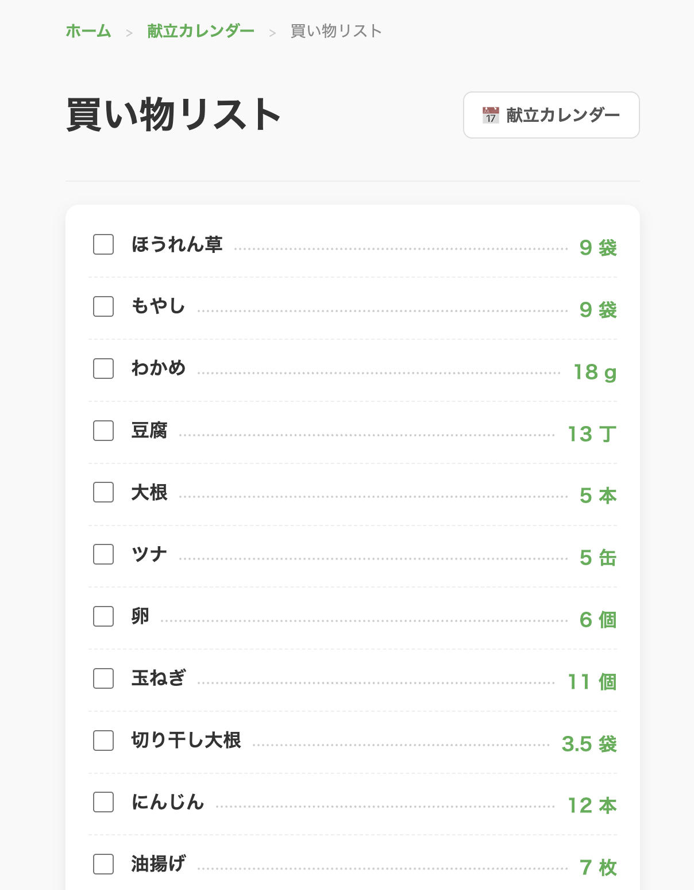

# 🥗 Meal Planner

毎日の献立作りをスマートに、料理をもっと楽しくする自分専用の献立・レシピ管理アプリです。
「今日何作ろう？」の悩みから、スーパーでの「何買うんだっけ？」までを一つのアプリで完結させます。

## ✨ 特徴

- **直感的な献立カレンダー**: 1週間の朝・昼・夜のメニューをグリッド形式で一目で確認。
- **自分だけのレシピ帳**: カテゴリ（主菜・副菜・汁物）や調理時間で整理された美しいレシピカード。
- **スマートな買い物リスト**: 献立から必要な材料を自動抽出し、チェックボックス形式で買い物中も便利。

## 📸 画面イメージ

### 🏠 ホーム画面
今日の献立や各機能への動線をまとめたトップ画面です。



---

### 🍳 レシピ一覧
登録したレシピを確認できます。



---

### 📖 レシピ詳細
登録したレシピの材料や手順を表示します。



---
### ➕ レシピ追加
新しいレシピを追加できます。



---
### 🗓 献立カレンダー
1週間の献立を一覧で確認できます。



---

### 📝 献立編集
献立を追加・編集できます。



---
### 🛒 買い物リスト
献立から自動生成された買い物リストを確認できます




## 🛠 使用技術
- **Backend**: Python / Flask
- **Frontend**: HTML5 / CSS3 / JavaScript
- **Database**: SQLite (SQLAlchemy)

## 🚀 ローカルでの起動方法

1. リポジトリをクローン
   ```bash
   git clone https://github.com/hazukiyoshikawa/meal-planner.git
   cd meal-planner
   python3 run.py